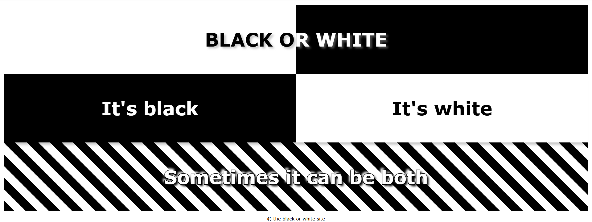

# Black or White: CSS Box Styling Showcase

A Front-End Web Development project that explores CSS gradients, box shadows, text shadows, and two-column page layouts using only HTML and CSS.

---

## Screenshot



---

## 🚀 Features

- Split black-and-white header created with a CSS linear gradient
- Custom text-shadow effects for typography enhancement
- Two-column black and white content layout
- Bottom-only box-shadow styling for depth
- Zebra-striped background generated entirely with CSS gradients
- Demonstrates CSS shorthand property usage and layout techniques

---

## 🛠️ Built With

* **HTML5:** Clean structural layout.
* **CSS3:** Built using shorthand syntax, display properties, custom shadows, and linear gradients.

---

## 📂 How to View & Run

### Clone the Repository
```bash
git clone https://github.com/mschlobohm-sdca-prog/css-box-styling-showcase.git
```

---

## Concepts Practiced
- CSS linear gradients
- Box shadows
- Text shadows
- Two-column layouts
- Float-Based Layouts
- CSS shorthand properties
- Visual hierarchy and contrast
- Typography styling

---

## Author

Matthew Schlobohm

GitHub: https://github.com/mschlobohm-sdca-prog
